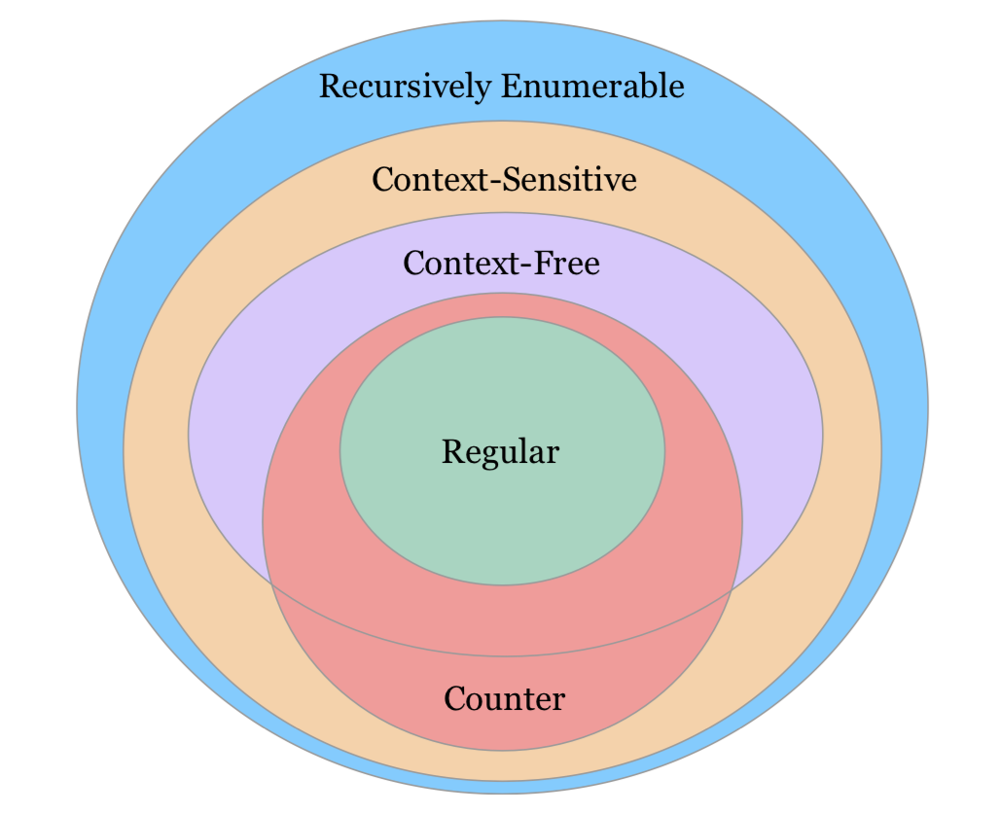
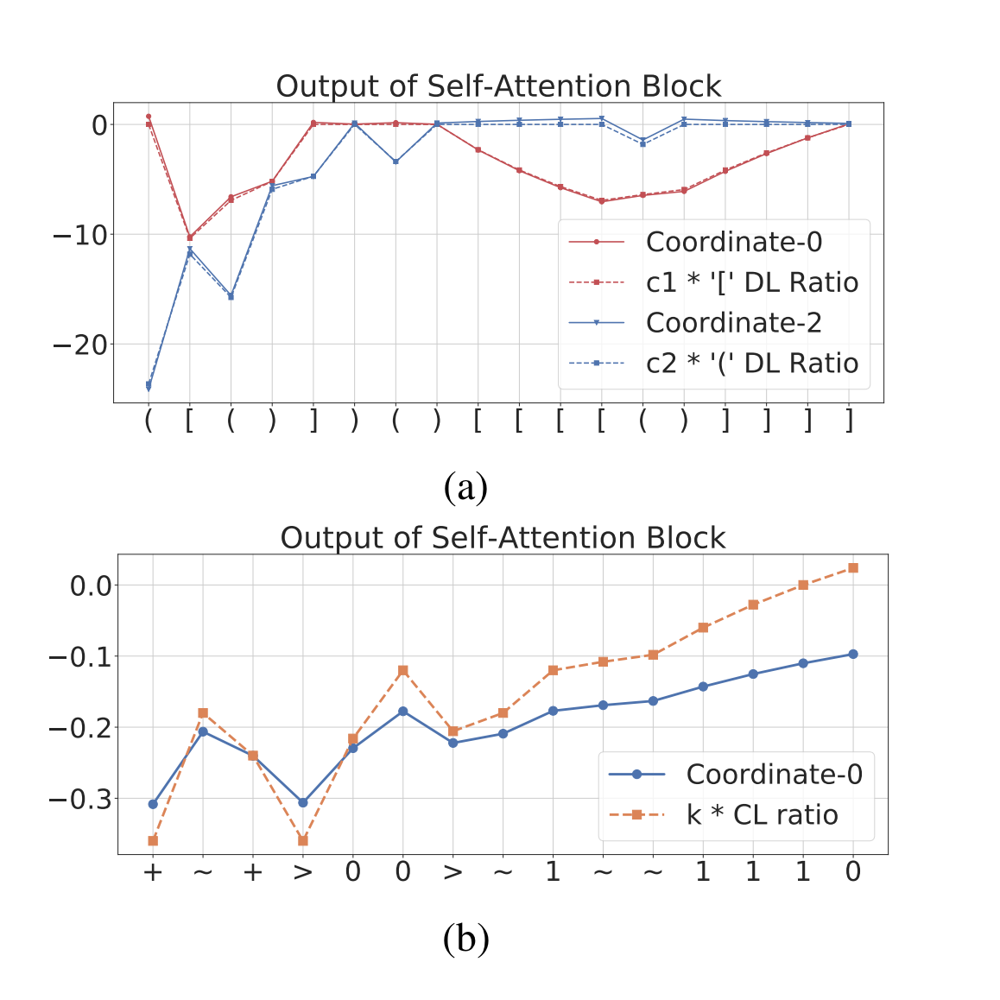

<h2 align="center">
  Transformer-Formal-Languages
</h2>
<h4 align="center"> On the Ability and Limitations of Transformers to Recognize Formal Languages </h4>

<p align="center">
  <a href="https://2020.emnlp.org/"></a>
  <a href="https://arxiv.org/abs/2009.11264"></a>
  <a href="https://github.com/satwik77/Transformer-Formal-Languages/blob/main/LICENSE">
    
  </a>
</p>


Transformers have supplanted recurrent models in a large number of NLP tasks. However, our understanding of their practical ability to model different behaviors relevant to sequence modeling is still nascent. On the other hand, a long line of research has sought to understand the computational capabilities of recurrent models such as the LSTMs.

<h2 align="center">
  
</h2>
Recent work has demonstrated close connections between LSTMs and counter automata. In our work, we seek to understand the capabilities of Transformers to model languages for which the abilities of LSTMs are well understood. In the paper, we first show that Transformers are expressive enough to recognize a subclass of counter languages, including well-studied languages such as n-ary Boolean Expressions, Dyck-1, and its generalizations (Section 4). In experiments, we find that Transformers do well on this subclass, and their learned mechanism strongly correlates with our construction (Section 6).

<h2 align="center">
  
</h2>
Perhaps surprisingly, in contrast to LSTMs, Transformers do well only on a subset of regular languages with degrading performance as we make languages more complex according to a well-known measure of complexity (Section 7).  Our results indicate that, in contrast to LSTMs, Transformers achieve limited performance on languages that involve modeling periodicity, modular counting, and even simpler star-free variants of Dyck-1, which they were able to recognize effortlessly. Our analysis also provides insights on the role of self-attention mechanism in modeling certain behaviors and the influence of positional encoding schemes on the learning and generalization abilities of the model.  


#### Dependencies

- Compatible with Python3.6 and Pytorch 1.2.0
- The necessary packages can be install through requirements.txt.

#### Setup

First create the required directories and extract the dataset by running setup.sh
```shell
chmod a+x setup.sh
./setup.sh
```
Install VirtualEnv using the following (optional):

```shell
$ [sudo] pip install virtualenv
```
We recommend creating a virtual environment(optional):

```shell
$ virtualenv -p python3 venv
$ source venv/bin/activate
```
Finally, install the required packages by running:

```shell
pip install -r requirements.txt
```

#### Resources
We provide all the datasets that we mention in the paper which are:
- `Shuffle-2`
- `TernaryBoolean`
- `Counter-3:`  $a^nb^nc^n$
- `Parity`
- `(aa)*`
- `(abab)*`
- `D-2: (a(ab)*b)*`
- `D-4: `
- `Tomita-{1-7}`

Extract the provided data zip file, in this repo's directory, such that you see a data/ subdirectory here containing all the above mentioned datasets.

#### Training the model

For training the model with default hyperparameter settings, execute the following command:

```bash
python -m src.main -mode train -run_name testrun -dataset <DatasetName> \
-model_type <ARCHITECTURE> -gpu <GPU-ID>
```
  - `run_name:` A unique identifier for an experiment, the location for storing model checkpoints and logs are determined using this.
  - `dataset:` Which dataset to train and validate the model on, choose from the list of datasets mentioned above.
  - `model_type:` Which type of neural network architecture would you like to choose for running the experiments, choose from RNN (by default LSTM is used), SAN (Transformer encoder), SAN-Rel (Transformer with relative position encodings).
  - `gpu:` For a multi-gpu machnine, specify the id of the gpu where you wish to run the training process. In case of single gpu just put 0 to use the default gpu. Note that the currently the code won't run without a GPU, we will provide support for running it on a CPU shortly.

Other hypeparameters can be found in the file src/args.py. Some important hyperparameters that might be worth noting are given below:
- `pos_encode:` Only applicable when model_type is SAN, adding -pos_encode in the training command described above, will initialize a transformer that uses absolute positional encodings. Without adding it, the model will not use any form of positional encoding.
- `d_model:` Applicable for model_type SAN and SAN-Rel, and is the size of the intermediate vectors used in the network. Eg. usage -d_model 32
- `heads:` Also applicable for SAN and SAN-Rel only, specifies the number of attention heads to use.
- `depth:` Number of layers that you would like to initialize your network with.

#### Generating Other Datasets

Apart from the datasets mentioned above, the supplementary material contains a list on much more formal languages. Although, not all of those datasets have been provided by us, it is easy to generate them using our data generation scripts. For example if you want to generate data for Shuffle-4, you just need to run:

```shell
python generate_data.py -lang Shuffle -num_par 4 -dataset Shuffle-4 \
-lower_window 2 -upper_window  50 -training_size 10000 -test_size 2000 -bins 2 -len_incr 50
```
Here,
 - `lang:` refers to the class of language for which you would like to generate data, can be Shuffle, Dyck, Parity, Tomita etc.
 - `num_par:` To select a particular language from a family of languages. Specifying 4 here refers to generating Shuffle-4 particularly.
 - `dataset:` The directory name where the generated data will be saved. The same name must be used in the training script, if you wish to run training on the generated dataset.
 - `lower_window:` Minimum length of the strings in training dataset.
 - `upper_window:` Maximum length of the strings in training datasets.
 - `training_size:` Number of strings to generate for training data.
 - `test_size:` Number of strings to generate for test/validation data.
 - `bins:` Number of validation bins.
 - `len_incr:` width of each validation window.

**Update**: All the datasets used in the main paper **as well as the appendix** can be downloaded via this [link](https://www.dropbox.com/s/99ehe9hr9g09lck/FinalDatasets.zip?dl=0)

For any clarification, comments, or suggestions please contact [Satwik](https://satwikb.com/) or [Kabir](https://github.com/kabirahuja2431).

